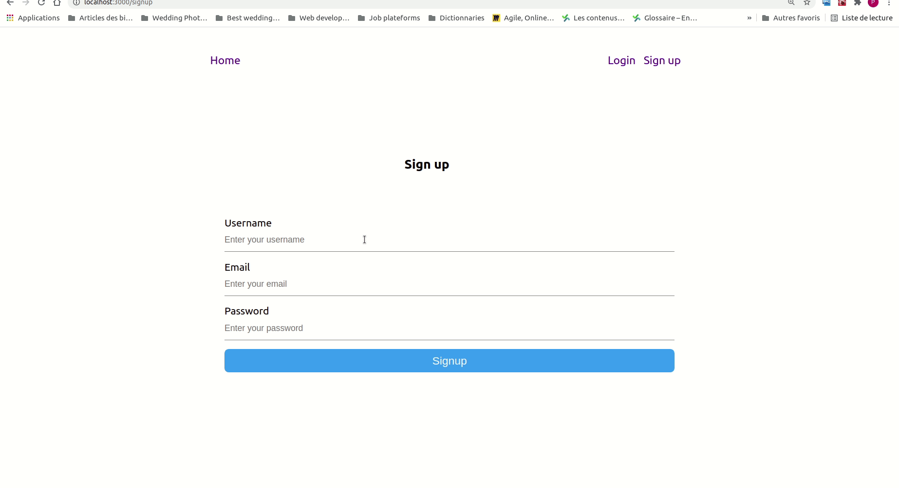
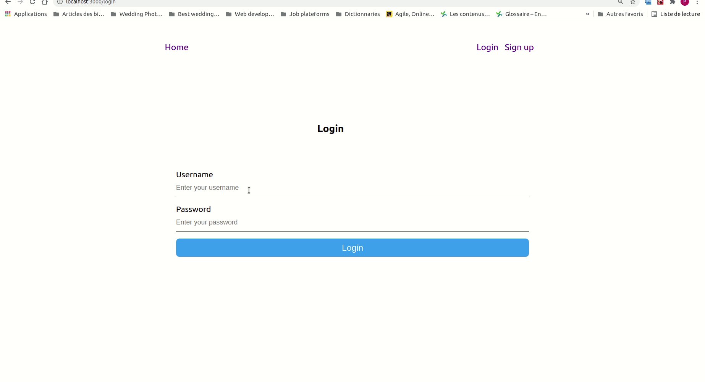
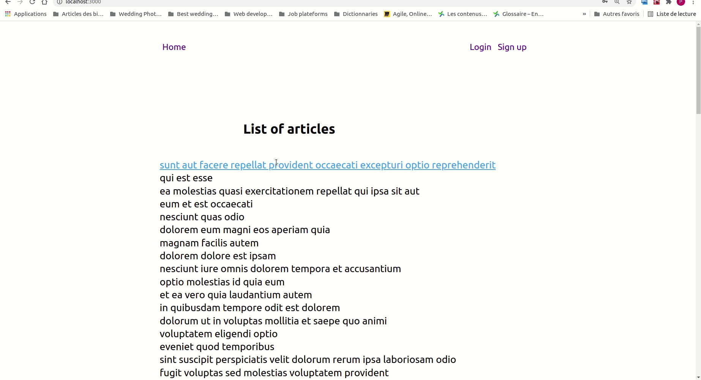
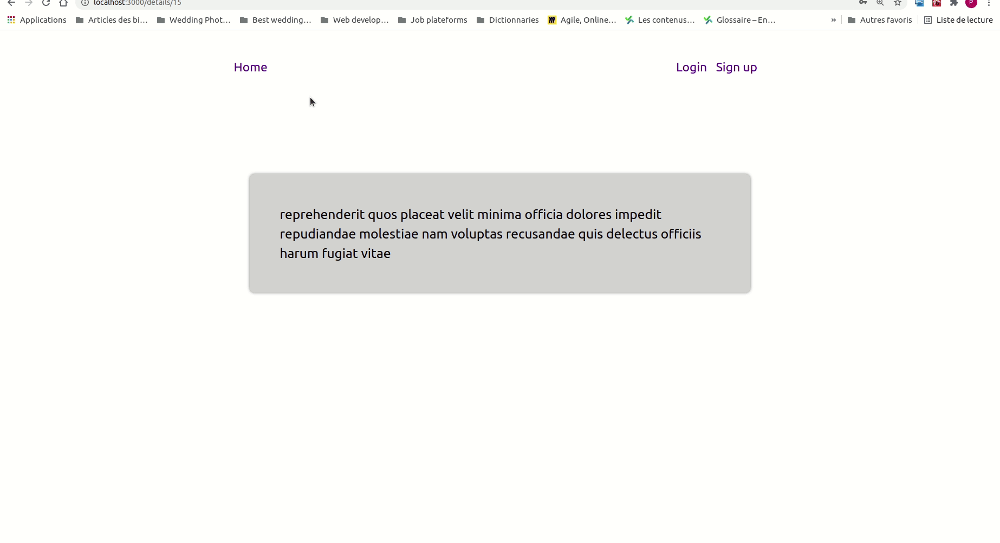

## Print-Content-App

This application was developped with ReactJs and API (https://jsonplaceholder.typicode.com/). It is responsive and adaptable to all types of screen devices. 

    
    
    
    
    
    

### User Stories

During the scoping meeting you got the following information:
- The application must have an authentication system with a simple role management
(user, admin)
- The administrator must be able to add a certain number of documents with the
necessary data for the generation. These documents are considered as "templates".
- A user can only access his generated documents
- A user must be able to generate a document from a "template" created by an
administrator by providing the required fields.

### Instructions
- Fork repository and clone it to your machine
- Install Nodejs if you haven't installed it yet
- Install dependencies

        npm install
- Run the application
        
        npm start

### Live App 
1. Signup

2. Login

3. Templates and Details 

4. Links

